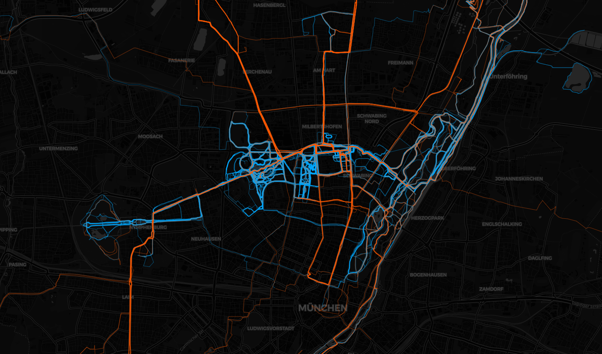
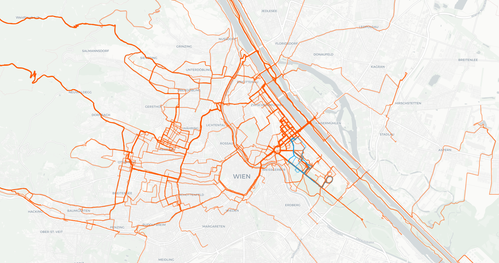
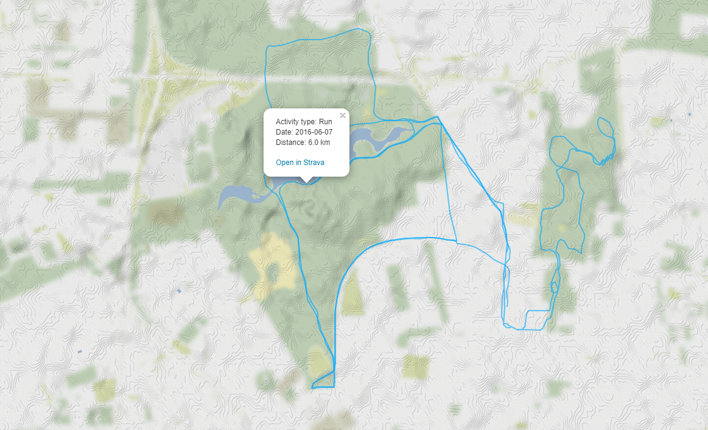
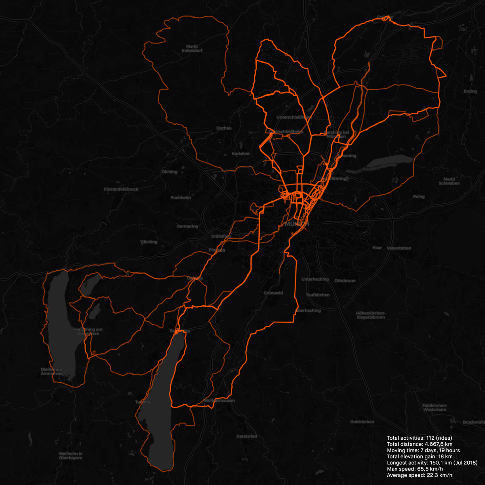

# Strava Local Heatmap Tool

[](https://buymeacoffee.com/roboes)

## Description

This repository aims to be a multi feature tool for locally manipulating Strava's bulk export archive file. The main features are:

- Unzip compressed (.gz) activities files.
- Remove leading first line blank spaces of .tcx activities files for properly importing it (feature not yet available directly in the `sweatpy` package, see [here](https://github.com/GoldenCheetah/sweatpy/issues/99)).
- Import multiple .fit/.gpx/.tcx activities files at once (without the need of conversion) and create local highly customizable heatmaps with different colors by activity type with the use of the `folium` library.
- Increment your Strava activities metadata by adding country, state, city, postal code, latitude, longitude geolocation information for each activity given the start recorded point (first non-missing latitude/longitude).

Additionally, it is possible to apply a series of filters to select the desired activities before performing the heatmap, such as activities that started inside a bounding box (within 4 corner latitude/longitude points) or activities realized in specific countries or states.

Although similar projects already exist (see [here](#see-also)), some of the features implemented in this project were partial or non-existent.

## Output

Munich Heatmap (rides in orange; runs in blue)

<p align="center">

</p>

Vienna Heatmap (rides in orange; runs in blue)

<p align="center">

</p>

Map interaction (option to navigate through the map, click in a line and get an activity summary pop-up)

<p align="center">

</p>

## Usage

### Bulk export your Strava data

Strava's bulk export process documentation can be found [here](https://support.strava.com/hc/en-us/articles/216918437-Exporting-your-Data-and-Bulk-Export#Bulk).

Note: Please keep in mind that Strava's bulk export is language sensitive, i.e. the activities column labels will depend on users' defined language preferences. This project assumes that your bulk export was realized in `English (US)`. To change the language, log in to [Strava](https://www.strava.com) and on the bottom right-hand corner of any page, select `English (US)` from the drop-down menu (more on this [here](https://support.strava.com/hc/en-us/articles/216917337-Changing-your-language-in-the-Strava-App)).

In essence, the process is as follows:

1. Log in to [Strava](https://www.strava.com).
2. Open the [Account Download and Deletion](https://www.strava.com/athlete/delete_your_account). Then press `Request Your Archive` button (Important: Don't press anything else on that page, particularly not the `Request Account Deletion` button).
3. Wait until Strava notifies you that your archive is ready via email. Download the archive file and unzip it to `Downloads/Strava` folder (or alternatively set a different working directory in the [strava-local-heatmap-tool.py](strava-local-heatmap-tool.py) code).

### Installation

```.ps1
python -m pip install "git+https://github.com/roboes/strava-local-heatmap-tool.git@main"
```

### Functions

#### `activities_import`

```.py
activities_import(activities_directory, activities_file, skip_geolocation)
```

##### Description

- Imports Strava `activities.csv` into a DataFrame and enriches it with geolocation data from .fit/.gpx/.tcx activity files by using the initial recorded coordinates (first non-missing latitude/longitude).

##### Parameters

- `activities_directory`: _path object_. Strava `activities` directory from the [Strava data bulk export](#bulk-export-your-strava-data).
- `activities_file`: _path object_. Strava `activities.csv` file from the [Strava data bulk export](#bulk-export-your-strava-data).
- `skip_geolocation`: _bool_, default: _True_. Skip geolocation retrieval for .fit/.gpx/.tcx activity files, using the initial recorded coordinates (first non-missing latitude/longitude). Note that geolocation retrieval relies on the public Nominatim instance (`nominatim.openstreetmap.org`), which may slow down the import process for exports containing a large number of activities (with ["an absolute maximum of 1 request per second"](https://operations.osmfoundation.org/policies/nominatim/)).

#### `activities_filter`

```.py
activities_filter(activities_df, activity_type=None, activity_location_state=None, bounding_box={'latitude_top_right': None, 'longitude_top_right': None, 'latitude_top_left': None, 'longitude_top_left': None, 'latitude_bottom_left': None, 'longitude_bottom_left': None, 'latitude_bottom_right': None, 'longitude_bottom_right': None})
```

##### Description

- Filter Strava activities DataFrame.

##### Parameters

- `activities_df`: Strava activities _DataFrame_. Imported from `activities_import()` function.
- `activity_type`: _str list_. If _None_, no activity type filter will be applied.
- `activity_location_state`: _str list_. If _None_, no state location filter will be applied.
- `bounding_box`: _dict_. If _None_, no bounding box will be applied.

Examples of `bounding_box`:

```.py
# Munich
bounding_box={
'latitude_top_right': 48.2316, 'longitude_top_right': 11.7170, # Top right boundary
'latitude_top_left': 48.2261, 'longitude_top_left': 11.4521, # Top left boundary
'latitude_bottom_left': 48.0851, 'longitude_bottom_left': 11.4022, # Bottom left boundary
'latitude_bottom_right': 48.0696, 'longitude_bottom_right': 11.7688 # Bottom right boundary
}
```

```.py
# Greater Munich
bounding_box={
'latitude_top_right': 48.4032, 'longitude_top_right': 11.8255, # Top right boundary
'latitude_top_left': 48.3924, 'longitude_top_left': 11.3082, # Top left boundary
'latitude_bottom_left': 47.9008, 'longitude_bottom_left': 11.0703, # Bottom left boundary
'latitude_bottom_right': 47.8609, 'longitude_bottom_right': 12.1105, # Bottom right boundary
}
```

```.py
# Southern Bavaria
bounding_box={
'latitude_top_right': 47.7900, 'longitude_top_right': 12.2692, # Top right boundary
'latitude_top_left': 47.7948, 'longitude_top_left': 10.9203, # Top left boundary
'latitude_bottom_left': 47.4023, 'longitude_bottom_left': 10.9779, # Bottom left boundary
'latitude_bottom_right': 47.4391, 'longitude_bottom_right': 12.3187, # Bottom right boundary
}
```

#### `strava_activities_heatmap`

```.py
strava_activities_heatmap(activities_df, activities_coordinates_df=activities_coordinates, activity_colors={'Hike': '#00AD43', 'Ride': '#FF5800', 'Run': '#00A6FC'}, map_tile='dark_all', map_zoom_start=12, line_weight=1.0, line_opacity=0.6, line_smooth_factor=1.0)
```

##### Description

- Create Heatmap based on inputted _activities_ DataFrame.

##### Parameters

- `activities_df`: Strava activities _DataFrame_, default: _activities_. Imported from `activities_import()` function.
- `activities_coordinates_df`: Strava activities coordinates _DataFrame_, default: _activities_coordinates_. Imported from `activities_import()` function.
- `strava_activities_heatmap_output_path`: _path object_. Path where the Strava activity heatmap will be saved.
- `activity_colors`: _dict_, default: _{'Hike': '#00AD43', 'Ride': '#FF5800', 'Run': '#00A6FC'}_. Depending on how many distinct `activity_type` are contained in the `activities` DataFrame, more dictionaries objects need to be added.
- `map_tile`: _str_, options: _'dark_all'_, _'dark_nolabels'_, _'light_all'_, _'light_nolabels'_, _'terrain_background'_, _'toner_lite'_ and _'ocean_basemap'_, default: _'dark_all'_.
- `map_zoom_start`: _int_, default: _12_. Initial zoom level for the map (for more details, check _zoom_start_ parameter for [folium.folium.Map documentation](https://python-visualization.github.io/folium/modules.html#folium.folium.Map)).
- `line_weight`: _float_, default: _1.0_. Stroke width in pixels (for more details, check _weight_ parameter for [folium.vector_layers.PolyLine](https://python-visualization.github.io/folium/modules.html#folium.vector_layers.PolyLine)).
- `line_opacity`: _float_, default: _0.6_. Stroke opacity (for more details, check _opacity_ parameter for [folium.vector_layers.PolyLine](https://python-visualization.github.io/folium/modules.html#folium.vector_layers.PolyLine)).
- `line_smooth_factor`: _float_, default: _1.0_. How much to simplify the polyline on each zoom level. More means better performance and smoother look, and less means more accurate representation (for more details, check _smooth_factor_ parameter for [folium.vector_layers.PolyLine](https://python-visualization.github.io/folium/modules.html#folium.vector_layers.PolyLine)).

#### `copy_activities`

```.py
copy_activities(activities_directory, activities_files=activities['filename'])
```

##### Description

- Copies a given .fit/.gpx/.tcx list of files to 'output/activities' folder.

##### Parameters

- `activities_directory`: _path object_. Strava `activities` directory from the [Strava data bulk export](#bulk-export-your-strava-data).
- `activities_files`: _list_, default: _activities['filename']_.

### Code Workflow Example

```.py
# Import packages
from strava_local_heatmap_tool.strava_local_heatmap_tool import activities_filter, strava_activities_heatmap, activities_import, gz_extract, tcx_lstrip
from plotnine import aes, geom_line, ggplot, labs, scale_color_brewer, theme_minimal

# Extract .gz files
gz_extract(activities_directory=os.path.join(os.path.expanduser('~'), 'Downloads', 'Strava Export', 'activities'))

# Remove leading first line blank spaces of .tcx activity files
tcx_lstrip(activities_directory=os.path.join(os.path.expanduser('~'), 'Downloads', 'Strava Export', 'activities'))

# Import Strava activities to DataFrame
activities_df, activities_coordinates_df = activities_import(
    activities_directory=os.path.join(os.path.expanduser('~'), 'Downloads', 'Strava Export', 'activities'),
    activities_file=os.path.join(os.path.expanduser('~'), 'Downloads', 'Strava Export', 'activities.csv'),
    skip_geolocation=True,
)


# Tests

## Check for activities without activity_gear
print(activities_df.query(expr='activity_gear.isna()').groupby(by=['activity_type'], level=None, as_index=False, sort=True, dropna=True).agg(count=('activity_id', 'nunique')))


## Check for activity_name inconsistencies
print(activities_df.query(expr='activity_name.str.contains(r"^ |  | $")'))

print(activities_df.query(expr='activity_name.str.contains(r"[^\\s]-|-[^\\s]")'))


## Check for distinct values for activity_name separated by a hyphen
print(
    pd.DataFrame(data=(activities_df.query(expr='activity_type == "Ride"')['activity_name'].str.split(pat=' - ', expand=True).stack().unique()), index=None, columns=['activity_name'], dtype=None).sort_values(
        by=['activity_name'],
        ignore_index=True,
    ),
)


## Check for distinct values for activity_description
print(
    pd.DataFrame(
        data=(
            activities_df.query(expr='activity_type == "Weight Training" and activity_description.notna()')['activity_description']
            .replace(to_replace=r'; | and ', value=r', ', regex=True)
            .str.lower()
            .str.split(pat=',', expand=True)
            .stack()
            .unique()
        ),
        index=None,
        columns=['activity_description'],
        dtype=None,
    ).sort_values(by=['activity_description'], ignore_index=True),
)


# Summary

## Count of activities by type
print(activities_df.groupby(by=['activity_type'], level=None, as_index=False, sort=True, dropna=True).agg(count=('activity_id', 'nunique')))


## Runs overview per year-month (distance in km)
print(
    activities_df.query(expr='activity_type == "Run"')
    .assign(activity_month=lambda row: row['activity_date'].dt.strftime(date_format='%Y-%m'))
    .groupby(by=['activity_month'], level=None, as_index=False, sort=True, dropna=True)
    .agg(count=('activity_id', 'nunique'), distance=('distance', lambda x: x.sum() / 1000)),
)


## Strava yearly overview cumulative (Plot)
strava_yearly_overview = (
    activities_df.query(expr='activity_type == "Ride"')
    .query(expr='activity_date >= "2017-01-01" and activity_date < "2023-01-01"')
    .assign(distance=lambda row: row['distance'] / 1000, year=lambda row: row['activity_date'].dt.strftime(date_format='%Y'), day_of_year=lambda row: row['activity_date'].dt.dayofyear)
    .assign(distance_cumulative=lambda row: row.groupby(by=['year'], level=None, as_index=False, sort=True, dropna=True)['distance'].transform('cumsum'))
    .filter(
        items=[
            'activity_date',
            'year',
            'day_of_year',
            'distance',
            'distance_cumulative',
        ],
    )
)

(
    ggplot(strava_yearly_overview, aes(x='day_of_year', y='distance_cumulative', group='year', color='factor(year)'))
    + geom_line()
    + scale_color_brewer(palette=1)
    + theme_minimal()
    + labs(title='Cumultative Distance (KM)', y='Distance (KM)', x='Day of Year', color='Year')
)

## Delete objects
del strava_yearly_overview


# Filter Strava activities
activities_df = activities_filter(
    activities_df=activities_df,
    activity_type=['Hike', 'Ride', 'Run'],
    activity_location_state=None,
    bounding_box={
        'latitude_top_right': None,
        'longitude_top_right': None,
        'latitude_top_left': None,
        'longitude_top_left': None,
        'latitude_bottom_left': None,
        'longitude_bottom_left': None,
        'latitude_bottom_right': None,
        'longitude_bottom_right': None,
    },
)


# Create heatmap
strava_activities_heatmap(
    activities_df=activities_df,
    activities_coordinates_df=activities_coordinates_df,
    strava_activities_heatmap_output_path=os.path.join(os.path.expanduser('~'), 'Downloads', 'strava-activities-heatmap.html'),
    activity_colors={'Hike': '#FF0000', 'Ride': '#00A3E0', 'Run': '#FF0000'},
    map_tile='dark_all',
    map_zoom_start=12,
    line_weight=1.0,
    line_opacity=0.6,
    line_smooth_factor=1.0,
)


# Copy activities files to 'output/activities' folder
# copy_activities(activities_directory=os.path.join(os.path.expanduser('~'), 'Downloads', 'Strava Export', 'activities'), activities_files=activities_df['filename'])


# Import .fit/.gpx/.tcx activity files into a DataFrame
# activities_coordinates_df = activities_coordinates_import(activities_directory=os.path.join(os.path.expanduser('~'), 'Downloads', 'Strava Export', 'activities'))


# Get geolocation for .fit/.gpx/.tcx activity files given the start recorded coordinates (first non-missing latitude/longitude)
# activities_geolocation = activities_geolocator(activities_coordinates_df=activities_coordinates_df, skip_geolocation=True)


# activities_file_rename(os.path.join(os.path.expanduser('~'), 'Downloads', 'Strava Export', 'activities'), activities_geolocation_df=activities_geolocation)
```

### Canvas Workflow: Save map as a high definition .png file and print it on canvas

Unfortunately Folium does not natively export a rendered map to .png.

A workaround is to open the rendered .html Folium map in Chrome, then open Chrome's Inspector, changing the width and high dimensions to 3500 x 3500 px, setting the zoom to 22% and the DPR to 3.0. Then capture a full size screenshot.

The [canvas.xcf](./templates/canvas.xcf) is a Gimp template for printing a canvas in 30 x 30 cm. Its design is similar to [this](https://www.reddit.com/r/bicycling/comments/7hiv41/i_printed_my_strava_heatmap_on_canvas_infos_in/) Reddit discussion:

<p align="center">

</p>

The statistics shown in the lower right corner are printed once the `strava_activities_heatmap()` function is executed.

## Documentation

[Strava API v3](https://developers.strava.com/docs/reference/#api-models-DetailedActivity): Definition of activities variables.

## See also

### Similar projects

These repositories have a similar or additional purpose to this project:

[Strava local heatmap browser](https://github.com/remisalmon/Strava-local-heatmap-browser): Code to reproduce the Strava Global Heatmap with local .gpx files (Python).

[Visualization of activities from Garmin Connect](https://github.com/andyakrn/activities_heatmap): Code for processing activities with .gpx files from Garmin Connect (Python).

[Create artistic visualisations with your Strava exercise data](https://github.com/marcusvolz/strava_py): Code for creating artistic visualizations with your Strava exercise data (Python; a R version is available [here](https://github.com/marcusvolz/strava)).

[strava-offline](https://github.com/liskin/strava-offline): Tool to keep a local mirror of Strava activities for further analysis/processing.

[dérive - Generate a heatmap from GPS tracks](https://erik.github.io/derive/): Generate heatmap by drag and dropping one or more .gpx/.tcx/.fit/.igc/.skiz file(s) (JavaScript, HTML).

### Articles

[Data Science For Cycling - How to Visualize GPX Strava Routes With Python and Folium](https://towardsdatascience.com/data-science-for-cycling-how-to-visualize-gpx-strava-routes-with-python-and-folium-21b96ade73c7) ([GitHub](https://github.com/better-data-science/data-science-for-cycling)).

[Build Interactive GPS activity maps from GPX files using Folium](https://towardsdatascience.com/build-interactive-gps-activity-maps-from-gpx-files-using-folium-cf9eebba1fe7) ([GitHub](https://github.com/datachico/gpx_to_folium_maps)).

### External links

[StatsHunters](https://www.statshunters.com): Connect your Strava account and show all your sport activities and added photos on one map.

Recommended [settings](https://www.statshunters.com/settings):

- [x] Receive monthly statistics by email
- [x] Hide my data in club heatmaps

[Cultureplot Custom Strava Heatmap Generator](https://cultureplot.com/strava-heatmap/): Connect to Strava to see your activity heatmap. Includes the possibility to filter the activities (by date, time and type) and to customize the map (map type, background color, line color (also by activity), thickness and opacity).
