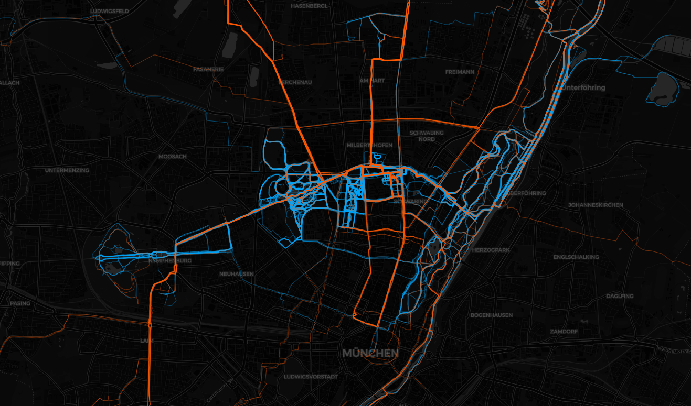
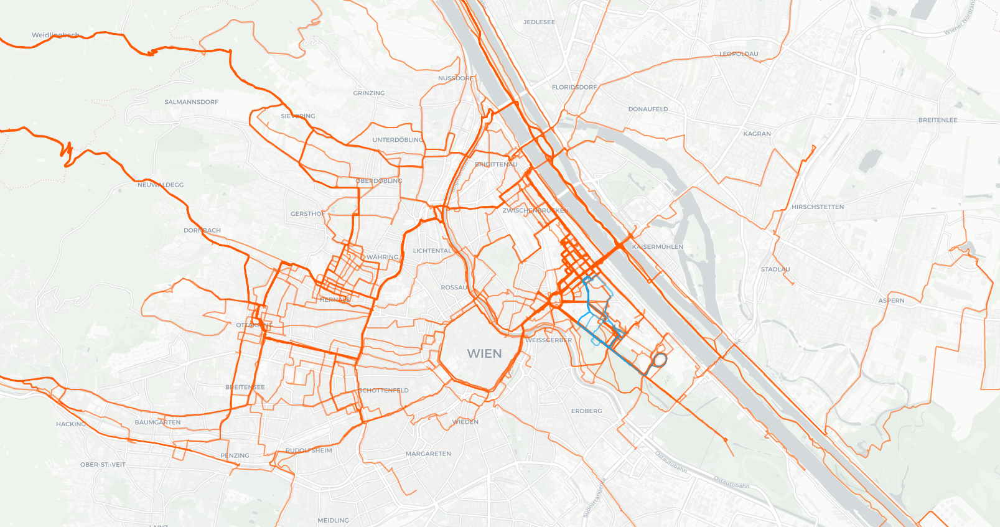
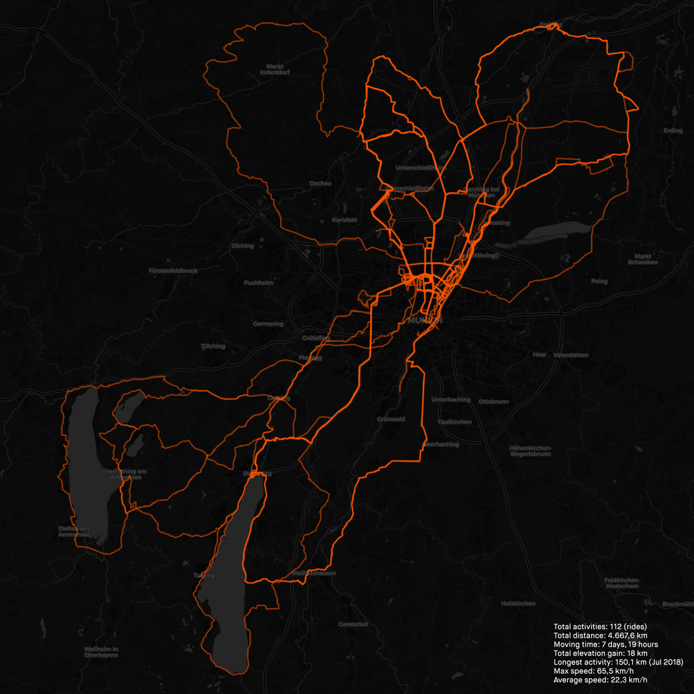

## Description

This repository aims to be a multi feature tool for locally manipulating Strava's bulk export archive file. The main features are:
1) Unzip compressed (.gz) activities files.
2) Remove leading first line blank spaces of .tcx activities files for properly importing it (feature not yet available directly in the ```sweatpy``` package, see [here](https://github.com/GoldenCheetah/sweatpy/issues/99)).
3) Import multiple .fit/.gpx/.tcx activities files at once (without the need of conversion) and create local highly customizable heatmaps with different colors by activity type with the use of the ```folium``` library.
4) Increment your Strava activities metadata by adding country, state, city, postalcode, latitude, longitude geolocation information for each activity given the start recorded point (first non-missing latitude/longitude).

Additionally, it is possible to apply a series of filters to select the desired activities before performing the heatmap, such as activities that started inside a region boundary rectangle (within 4 corner latitude/longitude points) or activities realized in specific countries or states.

Although similar projects already exist (see [here](#see-also)), some of the features implemented in this project were partial or non-existent.

### Heatmap

Munich (rides in orange; runs in blue) 

<p align="center">

</p>

Vienna (rides in orange; runs in blue) 

<p align="center">

</p>


## Usage

### Bulk export your Strava data 

Strava's bulk export process documentation can be found [here](https://support.strava.com/hc/en-us/articles/216918437-Exporting-your-Data-and-Bulk-Export#Bulk).

Note: Please keep in mind that Strava's bulk export is language sensitive, i.e. the activities column labels will depend on users' defined language preferences. This project assumes that your bulk export was realized in ```English (US)```. To change the language, log in to [Strava](https://www.strava.com) and on the bottom right-hand corner of any page, select ```English (US)``` from the drop-down menu (more on this [here](https://support.strava.com/hc/en-us/articles/216917337-Changing-your-language-in-the-Strava-App)).

In essence, the process is as follows:
1. Log in to [Strava](https://www.strava.com).
2. Open the [Account Download and Deletion](https://www.strava.com/athlete/delete_your_account). Then press ```Request Your Archive``` button (Important: Don't press anything else on that page, particularly not the ```Request Account Deletion``` button).
3. Wait until Strava notifies you that your archive is ready via email. Download the archive file and unzip it.

### Python dependencies

<code>python -m pip install numpy pandas pyjanitor geopy folium plotnine sweat</code>

### Run the script

Set working directory.

### Save map as a high definition .png file and print it on canvas

Unfortunately Folium does not natively export a rendered map to .png.

A workaround is to open the rendered .html Folium map in Chrome, then open Chrome's Inspector, changing the width and high dimensions to 3500 x 3500 px, setting the zoom to 22% and the DPR to 3.0. Then capture a full size screenshot (more on this [here](https://devland.at/a/how-to-take-a-high-dpi-full-page-screenshot-in-google-chrome)).

The [canvas.xcf](canvas.xcf) is a Gimp template for printing a canvas in 30 x 30 cm. Its design is similar to [this](https://www.reddit.com/r/bicycling/comments/7hiv41/i_printed_my_strava_heatmap_on_canvas_infos_in/) Reddit discussion:

<p align="center">

</p>

The code for calculating the statistics shown in the lower right corner can be found in the end of the [strava-local-heatmap-tool.py](strava-local-heatmap-tool.py) code.

## Documentation

[Strava API v3](https://developers.strava.com/docs/reference/#api-models-DetailedActivity): Definition of activities variables.

## See also

### Similar projects

These repositories have a similar or additional purpose to this project:

[Strava local heatmap browser](https://github.com/remisalmon/Strava-local-heatmap-browser): Code to reproduce the Strava Global Heatmap with local .gpx files (Python).

[Visualization of activities from Garmin Connect](https://github.com/andyakrn/activities_heatmap): Code for processing activities with .gpx files from Garmin Connect (Python).

[Create artistic visualisations with your Strava exercise data](https://github.com/marcusvolz/strava_py): Code for creating artistic visualisations with your Strava exercise data (Python; a R version is available [here](https://github.com/marcusvolz/strava)).

[strava-offline](https://github.com/liskin/strava-offline): Tool to keep a local mirror of Strava activities for further analysis/processing.

[dérive - Generate a heatmap from GPS tracks](https://erik.github.io/derive/): Generate heatmap by drag and dropping one or more .gpx/.tcx/.fit/.igc/.skiz file(s) (JavaScript, HTML).

### Articles

[Data Science For Cycling - How to Visualize GPX Strava Routes With Python and Folium](https://towardsdatascience.com/data-science-for-cycling-how-to-visualize-gpx-strava-routes-with-python-and-folium-21b96ade73c7) ([GitHub](https://github.com/better-data-science/data-science-for-cycling)).

[Build Interactive GPS activity maps from GPX files using Folium](https://towardsdatascience.com/build-interactive-gps-activity-maps-from-gpx-files-using-folium-cf9eebba1fe7) ([GitHub](https://github.com/datachico/gpx_to_folium_maps)).

### External links

[StatsHunters](https://www.statshunters.com): Connect your Strava account and show all your sport activities and added photos on one map.   

Recommended [settings](https://www.statshunters.com/settings):  
- [x] Receive monthly statistics by email  
- [x] Hide my data in club heatmaps

[Cultureplot Custom Strava Heatmap Generator](https://cultureplot.com/strava-heatmap/): Connect to Strava to see your activity heatmap. Includes the possibility to filter the activities (by date, time and type) and to customize the map (map type, background color, line color (also by activity), thickness and opacity).

[inonemap](https://inonemap.com): Connect to Strava to show multiple activities in one map.
